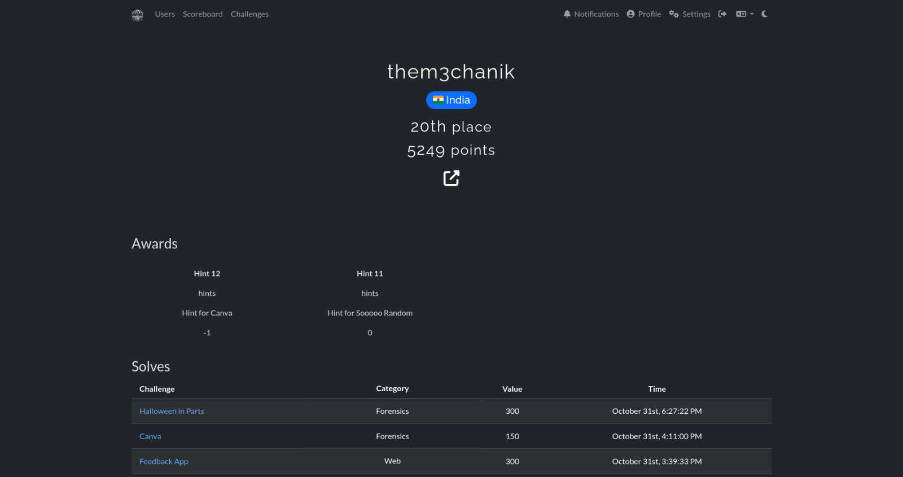

# [ Zer0D4y CTF — Operation: THEM3CHANIK.EXE ]

> “People are all alike. They love to pretend they’re different.”  
> — Elliot Alderson, _Mr. Robot_

───────────────────────────────────────────────  
 Date: 30–31 October 2025  
 Event: Zer0D4y CTF — Organized by Zer0 L0g0n  
 Format: Jeopardy Style  
───────────────────────────────────────────────  
📟 STATUS REPORT:  
─────────────────  
 User: them3chanik 🇮🇳  
 Rank: 20th place  
 Score: 5249 pts  
 Solved: 30 / 33 challenges  
 Failures: a few painful memories 😭  
─────────────────



---

## 🧠 Mission Log

So, here’s the deal — I joined **Zer0D4y CTF** thinking it starts on _31st October_.  
Turns out... it _started on the 30th_.  
Yeah. My face when I realized that.

> “Wake up, Mr. MechaniK... the system’s already running.”

Anyway — I sprinted in, caffeine-infused, hoodie on, and started shredding challenges like my terminal owed me money.

---

## 📚 What I Learned

- Timing is everything. Especially when you **read the rules properly**.
- Tiny bug, tiny tool — don’t use a Brahmāstra when grep or curl suffice
- Screenshot everything. Sleep nothing.
- And yes, `Courage the Cowardly Dog` can be a forensics instructor.

---

## 💀 Mistakes That Haunt My Bash History

- Didn’t check start time. Lost **~12 hours**.
- Complicating a challnge which is simple as hell.
- Not focusing on my forensics skill.

> “Control is an illusion.” — _Mr. Robot_

---

## 🧩 Challenges Cracked

```
GENERAL (3)
├─ [Sanity](./sanity/README.md)
├─ [Attachment](./attachment/README.md)
└─ [Back in 90s](./back_in_90s/README.md)

WEB (9)
├─ [Copy and Paste](./copy_and_paste/README.md)
├─ [Http Methods](./http_methods/README.md)
├─ [Robots](./robots/README.md)
├─ [Levels](./levels/README.md)
├─ [Directory of Dread](./directry_of_dead/README.md)
├─ [Picture Puzzle](./picture_puzzle/README.md)
├─ [Root of All Flags](./root_of_all_flags/README.md)
├─ [Rick You](./rick_you/README.md)
└─ [Feedback App](./feedback_app/README.md)

OSINT (5)
├─ [Just Google?](./just_google/README.md)
├─ [Just Google 2](./just_google2/README.md)
├─ [Doom Scroller](./doom_scroller/README.md)
├─ [Oversharer](./oversharer/README.md)
└─ [Oversharer 2](./oversharer2/README.md)

CRYPTO (4)
├─ [Rot 13](./rot13/README.md)
├─ [Cipher in Disguise](./cipher_in_disguise/README.md)
├─ [Layered Cipher](./layered_cipher/README.md)
└─ [sha256](./sha256/README.md)

REVERSE ENGINEERING (4)
├─ [Numbers to Flag](./numbers_to_flag/README.md)
├─ [Have the Pin?](./have_the_pin/README.md)
├─ [Paytm Karo](./paytm_karo/README.md)
└─ [Guessing Game](./guessing_game/README.md)

FORENSICS (5)
├─ [Author](./author/README.md)
├─ [Flash](./flash/README.md)
├─ [Canva](./canva/README.md)
├─ [Corrupted Courage](./corrupted_courage/README.md)
└─ [Halloween in Parts](./halloween_in_parts/README.md)
```

---

## 🧾 Stats Of Completion

```
🧠 General .............. 3 (100.00%)
🌐 Web ................... 9 (100.00%)
🔍 OSINT ................ 5 (100.00%)
🔐 Crypto ............... 4 (80.00%)
🧩 Reverse Engineering ... 4 (100.00%)
🕵️‍♂️ Forensics .......... 5 (71.43%)

💥 Total Solves: 30 / 33
📈 Score: 5249 pts
🏁 Rank: #20
```

> “If you can hack the time, you can hack the game.”

---

## 📈 Timeline of Insanity

From 12:40 AM to 6:27 PM —  
30 challenges.  
Zero sleep.  
A lot of “why is this not working??”  
and finally... _it did._

---

## 🧩 Reflection

Every CTF is a story — of puzzles, panic, and pure adrenaline.  
This one was my Halloween special: full of ghosts, GIFs, and GitHub commits at 4 AM.  
I walked away with 5249 points and the satisfaction of watching my score graph _rise like a kernel panic_.

---

> “The world is a hoax. We’re all living in one big hack.”  
> — Elliot Alderson

---

## ☎️ Contact

If you’re curious, confused, or just wanna collaborate —  
**contact@them3chanik.com**

Let's break things, fix things, and learn in between 💀

---

#### — M3K signing off 🕶️
