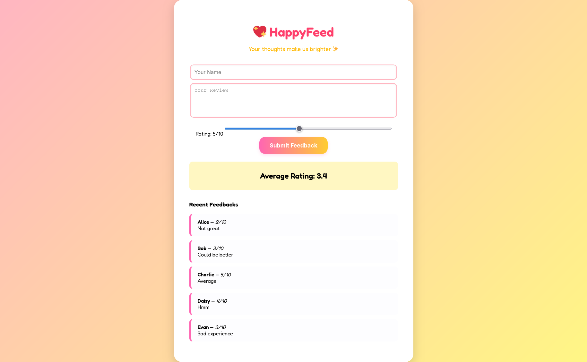

# 🧩 Challenge: Feedback App

**Category:** Web

**Points:** 300

---

### 🔖 Challenge Description

> My sister vibe coded this feedback app, but it seems her ratings aren’t very high. Can you find a way to increase her average rating?
>
> [Feedback App](https://vuln-feedback-app.onrender.com/)

---

### 🧭 Initial Reconnaissance

Cute site — gave it a click and tried to leave a 10/10 rating, but the app refused to bless my sister with perfection. 😕 I inspected the page to see what was stopping me.



---

### 🔍 Analysis & Enumeration

The rating input was a simple HTML range:

```html
<input type="range" id="rating" min="1" max="10" value="5">
```

Client-side limits only. Session-based restriction prevented multiple submissions, so the trick is to submit **one** submission with an inflated value. Since the max is enforced in the UI only, I edited the element via DevTools and pushed the `max` (and `value`) up.

---

### ⚙️ Exploitation Process

* Open DevTools → inspect the `#rating` input.
* Change `max="10"` → `max="1000000"` (and set `value` to the same).
* Submit the feedback once with the huge value. The server accepted it and the average shot up — flag revealed.

*(Short: inspect → modify input attributes → submit → flag.)*

---

### 🏁 Flag

```
zero{bright_feedback_success}
```

---

### 💡 Takeaways

* Client-side controls are cosmetic — modify the DOM when appropriate.
* When limited to one submission per session, make that one submission count.
* Automate or script DOM tweaks when you need repeatable higher-value tests.

---

**Solved by TheM3chanik — [contact@them3chanik.com](mailto:contact@them3chanik.com)**

