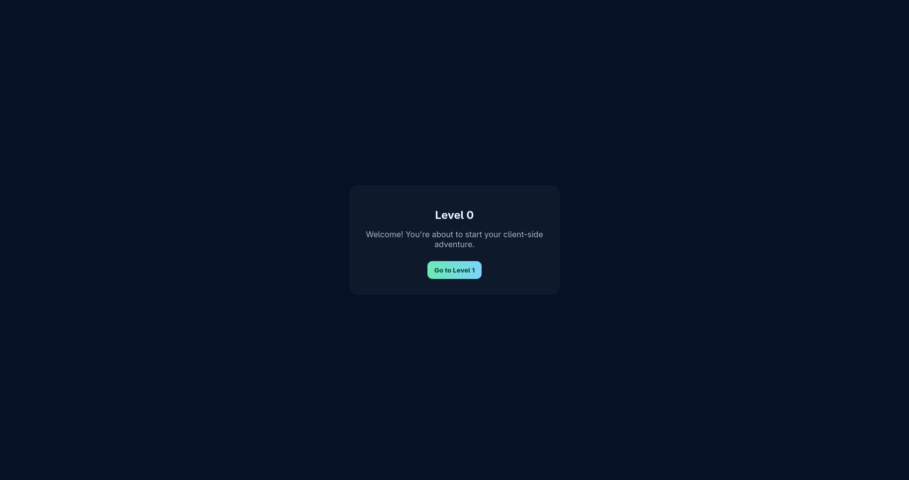
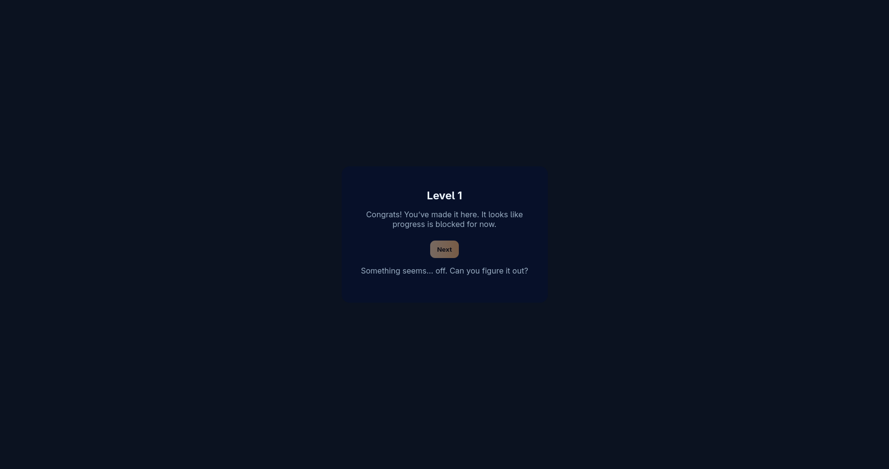
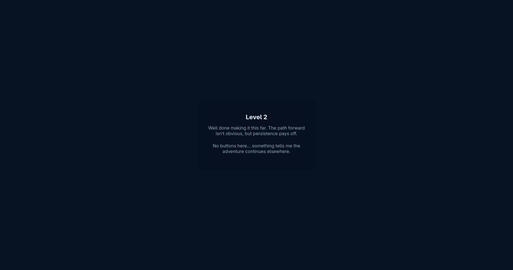
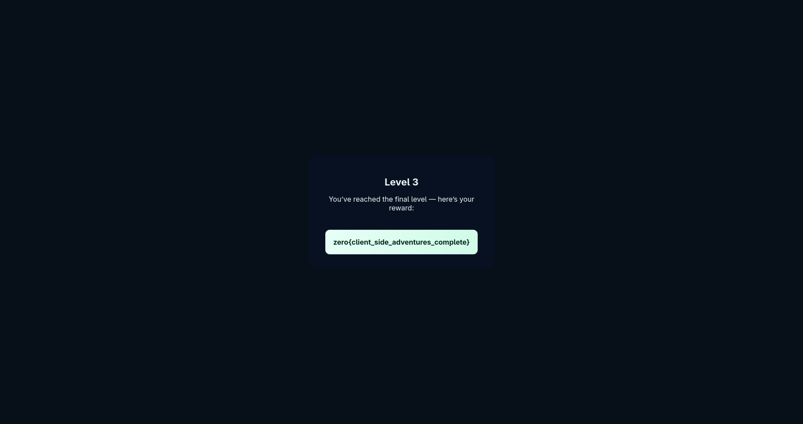

# 🧩 Challenge: Levels

**Category:** Web

**Points:** 100

---

### 🔖 Challenge Description

> Rise up the levels to get the flag
>
> [Link](https://levels-9pu.pages.dev/)

---

### 🧭 Initial Reconnaissance

I opened the provided link and landed on level 0 — a simple page with a “Level 1” button. 



I checked the page source (nothing useful), then clicked the Level 1 button to proceed.

---

### 🔍 Analysis & Enumeration

Then I clicked On the level1 button and I went to level 2 easy peasy.

Ok as you can see the `Next` button is disabled here. So I used my brahmastra the `inspect element`
And I change

```html
<button
  id="nextBtn"
  class="btn"
  disabled=""
  onclick="location.href='level2.html'"
>
  Next
</button>
```

into

```html
<button id="nextBtn" class="btn" onclick="location.href='level2.html'">
  Next
</button>
```

And the next button is enabled. 🗿

I cliecked on that and went to level2


But in this page no button there. Then my eyes went to the address bar. and noticed the URL was  `/level2` . 
I edited it to `/level3` (because why wait in lines when you can teleport?), hit enter, 


And the site rewarded me with the flag in plain sight

---

### ⚙️ Exploitation Process
1. Clicked Level 1.

1. Enabled the disabled “Next” button via Inspect Element (remove disabled).

1. On Level 2, manually changed the URL from /level2 → /level3.

1. Collected flag. No dancing required.
---

### 🏁 Flag

```
zero{client_side_adventures_complete}

```

---

### 💡 Takeaways
- Client-side controls are decorative — treat them like motivational posters, not locks.

- DevTools + a curious thumb on the address bar = instant level skip.

- If the site says "Rise up the levels", sometimes the elevator is broken — take the stairs (or just edit the URL).
---

**Solved by TheM3chanik — [contact@them3chanik.com](mailto:contact@them3chanik.com)**
