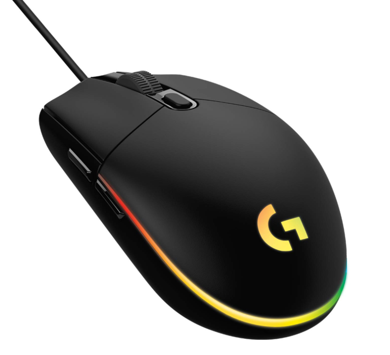

# 🧩 Challenge: Oversharer 2 

**Category:** OSINT

**Points:** 200

---

### 🔖 Challenge Description

> Which mouse does the OP use?  
>
> Flag format: Mouse name and model eg. Razer Viper Mini

---

### 🔎 Digging for Clues

So this one’s a **sequel** — the legendary *Oversharer* saga continues 🕵️‍♂️  
The hint instantly told me: time to revisit our old friend — the same [Reddit post](https://www.reddit.com/r/indianrailways/comments/1oifcy5/indian_railways_punishes_punctuality/).  

I headed straight to the user profile `u/Used_Adeptness4807` and started scrolling through their activity (yes, I became a full-time Reddit stalker for a minute 😎).  

Then bingo 💥 — a comment on a post about a **mouse** caught my attention:  
> “It’s good. Been using this for more than a year now. No issues so far.”  

Classic oversharer move 😏  
The post didn’t *say* the mouse name, but had an **image** instead.  



So I summoned my trusty ally — **Google Lens** 🔍  
Within seconds, it confirmed the mouse model as **Logitech G102**.  

---

### 🧩 Final Deduction

According to the flag format, the answer is:

```text
Logitech G102
````

---

### 🏁 Flag

```
Logitech G102
```

---

### 💡 Takeaways

* People reveal more online than they realize — sometimes, an image is all it takes 🧠
* Google Lens is an underrated OSINT superpower 🕶️
* OSINT isn’t always deep — sometimes it’s just scrolling… and noticing what others don’t 👀

---

**Solved by TheM3chanik — [contact@them3chanik.com](mailto:contact@them3chanik.com)**

---
